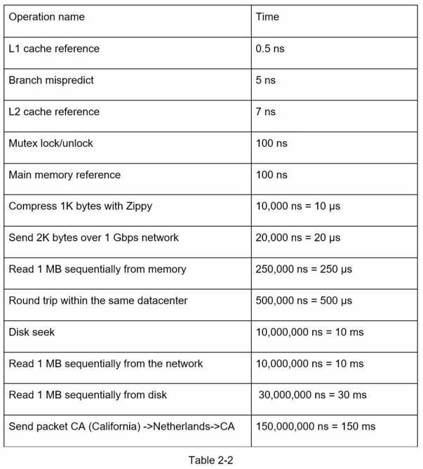
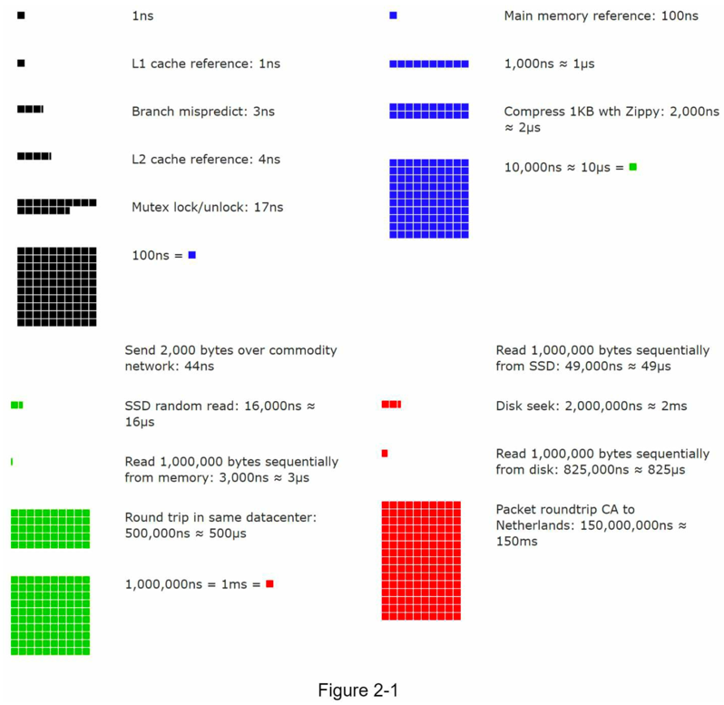
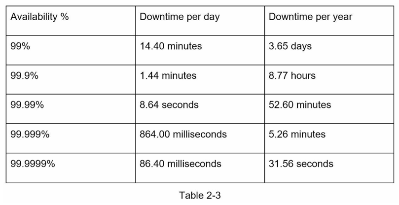

# 第02章：粗略估算

## CHAPTER 02：BACK-OF-THE-ENVELOPE ESTIMATION

## 第二章：粗略估算

在系统设计面试中，有时会要求你使用粗略估算来估计系统的容量或性能需求。根据谷歌高级研究员杰夫·迪恩（Jeff Dean）的说法，“粗略估算是使用一系列思维实验和常见性能数据的组合进行估算，以便对哪种设计能够满足你的要求有一个良好的了解” \[1]。

要有效地进行粗略估算，你需要对可扩展性基础知识有很好的了解。以下概念应该被深入理解：二的幂 \[2]、每个程序员都应该知道的延迟数字和可用性数字。

### 2的幂次方

尽管在处理分布式系统时数据量可能变得非常庞大，但所有计算归结为基础知识。为了获得正确的计算结果，了解使用二的幂的数据量单位至关重要。一个字节是8个位的序列。一个 ASCII 字符使用一个字节的内存（8位）。下面是解释数据量单位的表格（表2-1）。

### 每个程序员都应该了解的延迟数据

Google的Dean博士在2010年透露了典型计算机操作的时间\[1]。 随着计算机变得更快更强大，一些数字已经过时。然而，这些数字仍然应该能够让我们了解不同计算机操作的速度和慢速。

### 注意事项

ns = 纳秒, μs = 微秒, ms = 毫秒

1 ns = 10^-9 秒

1 μs= 10^-6 秒 = 1,000 ns

1 ms = 10^-3 秒 = 1,000 μs = 1,000,000 ns

一位谷歌软件工程师构建了一个工具来可视化Dean博士的数据。该工具还考虑了时间因素。 图2-1显示了截至2020年的可视化延迟数字（图源：参考资料\[3]）。

通过分析图2-1中的数字，我们得出以下结论：

* 内存速度快，但磁盘速度慢。
* 如果可能的话，应避免磁盘寻道。
* 简单的压缩算法速度快。
* 在发送数据到互联网之前，尽可能对数据进行压缩。
* 数据中心通常位于不同的区域，发送数据之间需要一定的时间。

### 可用性数据

高可用性是系统持续运行的能力，期望能够长时间保持操作。 高可用性通常以百分比表示，100%意味着服务没有任何停机时间。大多数服务的可用性介于99%到100%之间。

服务水平协议（SLA）是服务提供商常用的术语。这是你（服务提供商）与你的客户之间的协议，该协议正式定义了你的服务将提供的运行时间水平。 云服务提供商Amazon、Google和Microsoft将它们的SLA设置在99.9%或更高。系统的运行时间传统上以数字的形式进行测量。 数字越多，表示系统的运行时间越长。 如表2-3所示，数字数量与预期系统停机时间相关。 

### 示例：估算Twitter的查询量和存储需求

请注意，以下数字仅用于本练习，不是 Twitter 的真实数据。

假设：

* 每月活跃用户为3亿。
* 50%的用户每天使用 Twitter。
* 用户平均每天发布2条推文。
* 10%的推文包含媒体。
* 数据存储时间为5年。

估算： 查询每秒次数（QPS）估计：

* 每日活跃用户（DAU）= 3亿 \* 50% = 1.5亿
* 推文 QPS = 1.5亿 \* 2推文 / 24小时 / 3600秒 = 约 3500
* 峰值QPS = 2 \* QPS = 约 7000

我们这里只会估算媒体存储。

* 平均推文大小：
  * 推文ID 64 bytes（字节）
  * 文本 140 bytes（字节）
  * 媒体 1MB
* 媒体存储：1.5亿 \* 2 \* 10% \* 1MB = 每天30TB
* 5年媒体存储：30TB \* 365 \* 5 = 约 55PB

### 小贴士

粗略估计更注重过程而非结果。 解决问题比得到准确结果更为重要。 面试官可能会测试你的解决问题的能力。 以下是一些建议：

* 四舍五入和近似值。在面试中进行复杂的数学运算是困难的。例如，“99987 / 9.1”的结果是多少？没有必要花费宝贵的时间来解决复杂的数学问题。精确度并不是必需的。使用整数和近似值来简化问题。例如，“100,000 / 10”。
* 记下你的假设。写下你的假设是个好主意，以便以后参考。
* 标记你的单位。当你写下“5”时，它是指5 KB还是5 MB？这可能会让你感到困惑。写下单位，因为“5 MB”有助于消除歧义。
* 常见的粗略估计问题包括：QPS、峰值QPS、存储、缓存、服务器数量等。在准备面试时，你可以练习这些计算。熟能生巧。

祝贺你已经走到这一步！现在，给自己一个鼓励。干得漂亮！

#### 参考资料

\[1] J. Dean. Google专业提示：使用粗略估计来选择最佳设计： http://highscalability.com/blog/2011/1/26/google-pro-tip-use-back-of-the-envelope-calculations-to-choo.html \[2] 系统设计入门指南：https://github.com/donnemartin/system-design-primer \[3] 每个程序员都应该知道的延迟数据：https://colin-scott.github.io/personal\_website/research/interactive\_latency.html \[4] 亚马逊计算服务等级协议：https://aws.amazon.com/compute/sla/ \[5] 计算引擎服务等级协议（SLA）：https://cloud.google.com/compute/sla \[6] Azure服务的SLA摘要：https://azure.microsoft.com/en-us/support/legal/sla/summary/
